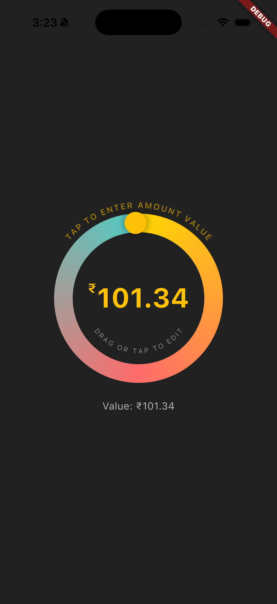

# Gradient Circular Slider

[](https://pub.dev/packages/gradient_circular_slider)
[](https://github.com/bharath-bandaru/circular_slider/blob/main/LICENSE)

A beautiful and customizable circular slider widget with gradient progress for Flutter applications. Perfect for creating intuitive and visually appealing value selectors with smooth animations and haptic feedback.

## Screeshot



## Features

✨ **Beautiful Gradient Progress** - Smooth color transitions with customizable gradients  
🎯 **Draggable Knob** - Interactive knob with shadow/glow effects that follows the circular path  
⌨️ **Tap-to-Edit Input** - Tap the center text to type an exact value with validation and clamping  
🧭 **Controller Support** - Use `GradientCircularSliderController` to dismiss edit mode programmatically  
🔤 **Dual Arc Labels** - Optional outer and inner curved labels that hug the ring perfectly  
📳 **Haptic Feedback** - Tactile feedback during interaction (configurable)  
🌀 **Initial Sweep Animation** - Optionally animate the first sweep after layout for delight  
🎭 **Smart Size/Position Animation** - Widget lifts toward the top and eases out while editing  
🎨 **Fully Customizable** - Colors, sizes, styles, shadows, and behaviors are all configurable

## Installation

Add `gradient_circular_slider` to your `pubspec.yaml`:

```yaml
dependencies:
  gradient_circular_slider: ^1.0.2
```

Then run:

```bash
flutter pub get
```

## Usage

### Basic Example

```dart
import 'package:gradient_circular_slider/gradient_circular_slider.dart';

GradientCircularSlider(
  minValue: 0,
  maxValue: 100,
  initialValue: 50,
  gradientColors: [Colors.blue, Colors.green],
  onChanged: (value) {
    print('Value: $value');
  },
)
```

### Advanced Example with Custom Styling

```dart
final sliderController = GradientCircularSliderController();

GradientCircularSlider(
  controller: sliderController,
  minValue: 0,
  maxValue: 101.99,
  initialValue: 101.34,
  gradientColors: const [
    Color(0xFFFFD700),
    Color(0xFFFF6B6B),
    Color(0xFF4ECDC4),
  ],
  initialSweepAnimationDuration: const Duration(milliseconds: 500),
  labelText: "TAP TO ENTER AMOUNT VALUE",
  labelStyle: TextStyle(
    color: Colors.amber.withAlpha(153),
    fontSize: 12,
    fontWeight: FontWeight.w600,
    letterSpacing: 2,
  ),
  innerLabelText: "DRAG OR TAP TO EDIT",
  innerLabelStyle: TextStyle(
    color: Colors.white.withAlpha(128),
    fontSize: 10,
    fontWeight: FontWeight.normal,
    letterSpacing: 2.5,
  ),
  prefix: "₹",
  prefixScale: 0.5,
  decimalPrecision: 2,
  ringThickness: 27,
  knobRadius: 16,
  textColor: Colors.amber,
  ringBackgroundColor: Colors.grey.shade800,
  knobColor: Colors.amber,
  enableHaptics: false,
  knobShadows: const [
    BoxShadow(
      color: Color.fromARGB(112, 0, 0, 0),
      blurRadius: 5,
      spreadRadius: 3,
    ),
  ],
  onChanged: (val) => debugPrint("Value: $val"),
  onChangeStart: () => debugPrint("Started dragging"),
  onChangeEnd: () => debugPrint("Stopped dragging"),
)
```

### Edit Mode & Controller

Tap the value inside the ring to enter edit mode. The circle scales up, slides toward the top, and the numeric text field becomes interactive (with optional prefixes, decimals, and validation).  
Use the optional `GradientCircularSliderController` to dismiss edit mode programmatically (for example when navigating away or tapping outside the widget).

```dart
final sliderController = GradientCircularSliderController();

GradientCircularSlider(
  controller: sliderController,
  initialValue: 42,
  // ...other options
);

// Dismiss edit mode from anywhere in your widget tree
sliderController.dismiss();
```

## Customization Options

| Parameter | Type | Description | Default |
|-----------|------|-------------|---------|
| `controller` | `GradientCircularSliderController?` | Provides `dismiss()` to exit edit mode programmatically | `null` |
| `minValue` | `double` | Minimum slider value | `0` |
| `maxValue` | `double` | Maximum slider value | `120` |
| `initialValue` | `double` | Starting value inside the ring (required) | — |
| `initialSweepAnimationDuration` | `Duration` | Adds a delayed sweep animation after layout | `Duration.zero` |
| `gradientColors` | `List<Color>` | Colors for the circular gradient (min 2) | `[Colors.lightBlueAccent, Colors.blue]` |
| `ringThickness` | `double` | Width of the circular ring | `20.0` |
| `ringBackgroundColor` | `Color?` | Background/track color of the ring | `Colors.grey.withAlpha(51)` |
| `prefix` | `String` | Symbol before the value (e.g. `$`, `₹`, `%`) | `'$'` |
| `prefixScale` | `double` | Ratio of prefix font size to value font (0–1) | `0.6` |
| `textColor` | `Color` | Color for the center value while not editing | `Colors.white` |
| `decimalPrecision` | `int` | Digits after the decimal point | `2` |
| `labelText` | `String?` | Optional curved label along the top of the ring | `null` |
| `labelStyle` | `TextStyle?` | Style for the outer curved label | `null` |
| `innerLabelText` | `String?` | Optional curved label along the inner ring | `null` |
| `innerLabelStyle` | `TextStyle?` | Style for the inner curved label | `null` |
| `enableHaptics` | `bool` | Enables light/medium haptic feedback while dragging | `true` |
| `knobRadius` | `double` | Size of the draggable knob | `15` |
| `knobColor` | `Color?` | Color of the knob fill | `Colors.white` |
| `knobShadows` | `List<BoxShadow>?` | Custom drop shadows for the knob | Gentle default glow |
| `animationDuration` | `Duration` | Duration for value interpolation when animating | `500ms` |
| `animationCurve` | `Curve` | Curve for value interpolation | `Curves.easeInOut` |

## Callbacks

| Callback | Type | Description |
|----------|------|-------------|
| `onChanged` | `ValueChanged<double>?` | Called when the value changes |
| `onChangeStart` | `VoidCallback?` | Called when dragging starts |
| `onChangeEnd` | `VoidCallback?` | Called when dragging ends |

## Examples

### Currency Selector
```dart
GradientCircularSlider(
  minValue: 0,
  maxValue: 10000,
  initialValue: 5000,
  gradientColors: [Colors.green, Colors.blue],
  prefix: "\$",
  labelText: "SELECT AMOUNT",
)
```

### Percentage Slider
```dart
GradientCircularSlider(
  minValue: 0,
  maxValue: 100,
  initialValue: 75,
  gradientColors: [Colors.red, Colors.orange, Colors.yellow],
  prefix: "%",
  decimalPrecision: 0,
  labelText: "COMPLETION",
)
```

### Temperature Control
```dart
GradientCircularSlider(
  minValue: 16,
  maxValue: 30,
  initialValue: 22,
  gradientColors: [Colors.blue, Colors.red],
  prefix: "°",
  decimalPrecision: 1,
  labelText: "TEMPERATURE",
)
```

## Performance

The widget is optimized for smooth 60fps performance on all modern devices:
- Efficient rebuilds with only necessary repaints
- Hardware-accelerated rendering
- Optimized gesture detection
- Smooth animations with customizable curves

## Contributing

Contributions are welcome! Please feel free to submit a Pull Request.

1. Fork the repository
2. Create your feature branch (`git checkout -b feature/AmazingFeature`)
3. Commit your changes (`git commit -m 'Add some AmazingFeature'`)
4. Push to the branch (`git push origin feature/AmazingFeature`)
5. Open a Pull Request

## Author

Created with ❤️ by Bharath Bandaru

## Support

If you find this package helpful, please consider giving it a ⭐ on [GitHub](https://github.com/yourusername/gradient_circular_slider)!
